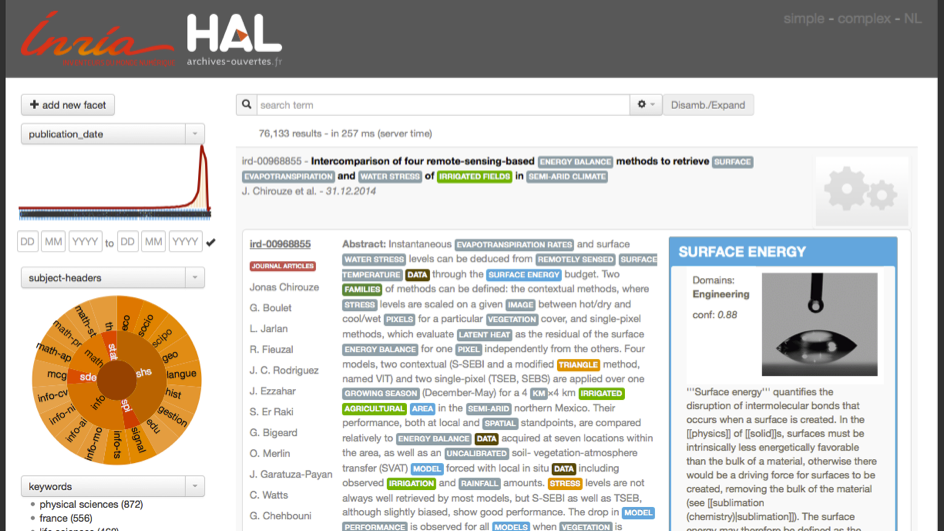
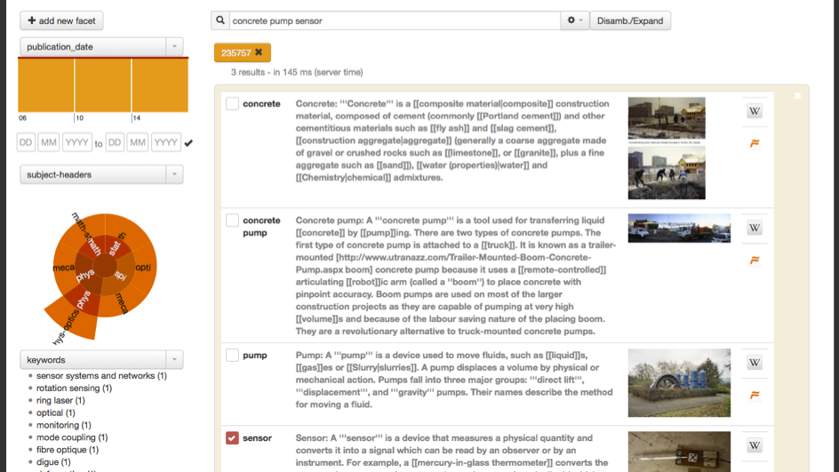

# AnHALytics

AnHALytics is a project aiming at creating an analytic platform for the [HAL research archive](https://hal.archives-ouvertes.fr) or other scientific Open Access repositories, exploring various analytic aspects such as search/discovery, activity and collaboration statistics, trend/technology maps, knowledge graph and data visualization. The project is supported by an [ADT Inria](http://www.inria.fr/en/research/research-teams/technological-development-at-inria) grant and good will :). 



*Above: View of anHALytics search and discovery front end*



*Above: Example of query disambiguation in the anHALytics search and discovery front end*

## License

This code is distributed under [Apache 2.0 license](http://www.apache.org/licenses/LICENSE-2.0). 

## Warning

AnHALytics is a work at early stage and a work in progress. It is evolving rapidly and is certainly not production ready! 

## People

- Achraf Azhar
- [Patrice Lopez](https://github.com/kermitt2) 

If you are interested in contributing to the project, please contact <patrice.lopez@inria.fr>. 

### Prerequisites:

For building and running the project, you will need the following components. 

###### 1. Java/Maven

[JAVA](https://java.com/en/download/manual_java7.jsp) +
[Maven](https://maven.apache.org)

###### 2. GROBID (GeneRation Of BIbliographic Data)

[Grobid](https://github.com/kermitt2/grobid) is used for document digestion, which means extracting metadata and structured full text in ([TEI](http://www.tei-c.org/Guidelines/)). [Grobid](https://github.com/kermitt2/grobid) is a machine learning library for extracting bibliographical information and structured full texts from technical and scientific documents, in particular from PDF distributed under Apache 2 license.

Clone the project from github:

	git clone https://github.com/kermitt2/grobid.git

AnHALytics uses GROBID as a service so that we can use distribution and multithreaded process easily. See the [GROBID documentation](http://grobid.readthedocs.org) on how to start the RESTful service. Once the service is ready, update the ``anhalytics-harvest/harvest.properties`` file.

###### 3. Nerd (Named Entity Recognition and Disambiguisation)

The NERD service annotates the text by recognizing and disambiguating terms. Entities are currently identified against Wikipedia/FreeBase. In this project, the NERD is using the free disambiguation service, and the recognition and disambiguation is not constrained by a preliminary Named Entity Recognition. 

At the present date, only the NER part of the NERD is available in open source (see [grobid-ner](https://github.com/kermitt2/grobid-ner). The full NERD repo will be made publicly available on GitHub soon under Apache 2 license. 

###### 4. ElasticSearch

[Elasticsearch](https://github.com/elastic/elasticsearch) is a distributed RESTful search engine. Specify (and adapt if you want more shards and replicas) the following in the ElasticSearch config file (elasticsearch.yml):

    cluster.name: traces # or something else
    index.number_of_shards: 1
    index.number_of_replicas: 0
    cluster.routing.allocation.disk.threshold_enabled: false
    cluster.routing.allocation.disk.watermark.low: 95
    cluster.routing.allocation.disk.watermark.high: 99
    http.jsonp.enable: true

don't forget to update ``anhalytics-frontend/src/main/webapp/js/resource/config.js`` and ``anhalytics-index/index.properties`` with the correct settings for your local installation of ElasticSearch and NERD service.

###### 5. MongoDB

A running instance of [MongoDB](https://www.mongodb.org) is required for document persistence and document provision. Once installed, add an admin user and update the sub-project property file ``anhalytics-commons/commons.properties``.

###### 6. Web server

A web server, such as Tomcat or Jetty, is necessary to deploy the front demos which are packaged in a war file.

### Project design

AnHALytics has (so far) six components corresponding to six sub-projects:

0. __common__ contains methods and resources shared by several other components. 
1. __harvest__ performs the document acquisition and digestion: harvesting scientific documents and production of TEI representations combined with downloaded metadata. 
2. __annotate__ realises document enrichment, more precisely it disambiguates and annotates entities into the extracted TEI structures.
3. __index__ performs indexing in ElasticSearch for both the final TEIs and the annotations.
4. __frontend__ contains all the demo views (search, author, document, analytics..).
5. __test__ is dedicated to integration tests.

### Compilation

Clone the git repo with:

    git clone https://github.com/kermitt2/anHALytics
    
Compile and build using maven:

    cd anHALytics
    mvn clean install
	
### Components:

#### 1. Harvesting

Currently only OAI-PMH is used as harvesting protocol. 

An executable jar file is produced under the directory ``anhalytics-harvest/target``.

The following command displays the help:

> java -jar target/anhalytics-harvest-```<current version>```.one-jar.jar -h

For a large harvesting task, use -Xmx2048m to set the JVM memory to avoid OutOfMemoryException.

###### HarvestAll / HarvestDaily

To start harvesting all the documents of HAL based on [OAI-PMH](http://www.openarchives.org/pmh) v2, use:

> java -Xmx2048m -jar target/anhalytics-harvest-```<current version>```.one-jar.jar -exe harvestAll

Harvesting is done through a reverse chronological order, here is a sample of the OAI-PMH request:
http://api.archives-ouvertes.fr/oai/hal/?verb=ListRecords&metadataPrefix=xml-tei&from=2015-01-14&until=2015-01-14

To perform an harvesting on a daily basis, use:

> java -Xmx2048m -jar target/anhalytics-harvest-```<current version>```.one-jar.jar -exe harvestDaily

For instance, the process can be configured on a cron table.

###### Grobid processing

Once the document are downloaded, the TEI extrating threads will run automatically. You can also run the process manually with
> java -Xmx2048m -jar target/anhalytics-harvest-```<current version>```.one-jar.jar -exe processGrobid

###### Final TEI building

The final TEI is built and has the following struture

```xml
    <teiCorpus>
        <teiHeader>
            <!-- Consolidated harvested metadata, from HAL for example, with entity 
				(author, affiliation, etc.) disambiguation -->
        </teiHeader>
        <TEI>
            <!-- GROBID automatically extracted data -->
        </TEI>
    </teiCorpus>
```

At least the GROBID TEI is necessary to produce the final TEI, you can do so with:
> java -Xmx2048m -jar target/anhalytics-harvest-```<current version>```.one-jar.jar -exe buildTei

###### Document storage and provision

We use MongoDD GridFS component for document file support. Each type of files are stored in a different collection. hal tei => hal-tei-collection , binaries => binaries-collection,..., 

<!-- documentation of the collections here !! -->

#### 2. Annotate

The documents are enriched with semantic annotations. This is realized with the NERD service.

An executable jar file is produced under the directory ``anhalytics-annotate/target``.

The following command displays the help:
> java -Xmx2048m -jar target/anhalytics-annotate-```<current version>```.one-jar.jar -h

###### Annotation of the HAL collection

The annotation on the HAL collection cab be launch with the command in the main directory of the sub-project ``anhalytics-annotate/``:

>java -Xmx2048m -jar target/anhalytics-annotate-```<current version>```.one-jar.jar -multiThread

(-multiThread option is recommended, it takes time)

###### Storage of annotations

Annotations are persistently stored in a MongoDB collection and available for indexing in ElasticSearch. 

#### 3. Indexing

###### Indexing TEI

To index the final TEI documents, in the main directory of the sub-project ``anhalytics-annotate/``:
>java -Xmx2048m -jar target/anhalytics-annotate-```<current version>```.one-jar.jar -index tei

###### Indexing annotations

For indexing the produced annotations in ElasticSearch, in the main directory of the sub-project ``anhalytics-annotate/``:

>java -Xmx2048m -jar target/anhalytics-annotate-```<current version>```.one-jar.jar -index annotation

#### 4. Frontends

A war file is produced under the directory ``anhalytics-frontend/target``, you can use Tomcat for instance to deploy it (make sur the ES and Nerd options are set). The front-end javascript web application will call ElasticSearch and MongoDB services as set in the main project. 

#### 5. Test

In progress...
